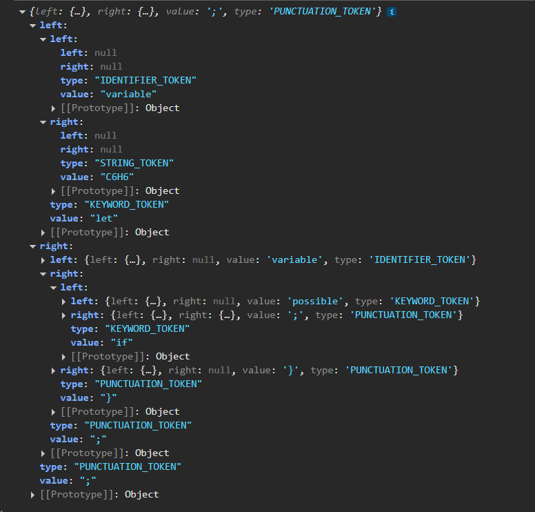

# Parser and Its Applications

### Course: Formal Languages & Finite Automata
### Author: Titerez Vladislav

----

## Theory

A **parser** is a fundamental component in the field of formal languages and automata. It processes input sequences according to a set of grammatical rules, determining their syntactic structure. Parsing is widely used in **compilers, interpreters, natural language processing, and structured data processing**.

A parser operates based on **context-free grammars (CFGs)** and can be classified into two main types:

- **Top-Down Parsing:** Starts from the root (start symbol) and tries to derive the input string.
- **Bottom-Up Parsing:** Starts from the input string and attempts to reconstruct the derivation leading to the start symbol.

Common algorithms used in parsing include:

- **Recursive Descent Parsing:** A straightforward top-down approach.
- **LL and LR Parsing:** Used in programming language compilers.
- **CYK (Cocke-Younger-Kasami) Algorithm:** Utilizes **Chomsky Normal Form (CNF)** for efficient string validation.

### Applications of Parsers:
- **Syntax Analysis in Compilers:** Converts high-level code into an abstract syntax tree (AST).
- **Natural Language Processing (NLP):** Analyzes sentence structures for translation and grammar checking.
- **Data Parsing:** Extracting structured information from files (e.g., JSON, XML, CSV).
- **Automated Theorem Proving:** Parses logical expressions to validate proofs.

## Objectives

- Understand the role of parsers in formal languages.
- Implement a JavaScript parser for a given context-free grammar.
- Apply transformations and validation steps for correct parsing.
- (Bonus) Implement step-by-step debugging output for better understanding.

## Implementation Description

The solution consists of a JavaScript **Parser** class that processes input strings based on a given CFG. The program follows these steps:

1. **Tokenization:** Splitting input into symbols based on the grammar.
2. **Grammar Validation:** Ensuring rules are well-formed and correctly structured.
3. **Parsing Algorithm:**
   - Using recursive descent or a table-driven approach.
   - Constructing a parse tree.
   - Checking whether the input belongs to the language defined by the grammar.
4. **Error Handling:** Providing useful feedback for invalid inputs.
5. **Optimizations:** Handling ambiguities, left recursion, and predictive parsing improvements.

## Code Implementation

```js
export default class Parser{
    constructor(tokens){
        this.tokens = tokens;
        this.node = {left: null, right: null, value: null, type: null};
        this.position = 0;
        this.end = this.tokens.length;
        this.root = this.node;
        this.leftRoot = this.node.left;
        this.rightRoot = this.node.right;
        this.set = new Set(["elif", "else", "if"]);
        this.isGood = true;
        this.identifiers = new Set();
    }

    isAtEnd(){
        return this.position >= this.tokens.length;
    }

    peek(){
        return this.tokens[this.position];
    }

    findEXP(start, end){
        for(let i = start; i < end; i++){
            if(this.tokens[i].value === ";"){
                return i;
            }
        }
        return end;
    }

    findEXPcur(start, end){
        let count = 0, endedCondition;
        for(let i = start; i < end; i++){
            if(this.tokens[i].value === "{"){
                endedCondition=i;
                break;
            }
        }
        for(let i = endedCondition; i < end; i++){
            if(this.tokens[i].value === "{"){
                count++;
            } else if(this.tokens[i].value === "}"){
                count--;
                if(count === 0){
                    return i;
                }
            } 
        }
        return end;
    }

    advance(){
        return this.tokens[this.position++];
    }

    findKeyword(start, end){
        if(this.tokens[start].type === "IDENTIFIER_TOKEN" && this.tokens[start+1].value === "=" ){
            return start;
        }
        for(start; start < end; start++){
            if(this.tokens[start].type === "KEYWORD_TOKEN"){
                return start;
            }
        }
    }


    initHandler(start, end, key){
        if(key === start){
            this.leftRoot.value = this.tokens[key]?.value; 
            this.leftRoot.type = this.tokens[key]?.type;
            if(this.tokens[key+1].type === "IDENTIFIER_TOKEN"){
                this.identifiers.add(this.tokens[key+1].value);
                this.leftRoot.left = {left: null, right: null, value: this.tokens[start+1].value, type: this.tokens[start+1].type};
            } 
            if(end-start === 4){ 
                this.leftRoot.right = {left: null, right: null, value: this.tokens[end-1].value, type: this.tokens[end-1].type};
            } else if(this.tokens[start+3]?.type==="KEYWORD_TOKEN"){
                this.leftRoot.right = {left: null, right: null, value: this.tokens[key+3].value, type: this.tokens[key+3].type};
                this.rightRoot = this.leftRoot.right;
                this.generalHandler(start+3, end, key+3, this.rightRoot);
            }
        } else {
            this.isGood = false;
            alert("Near key: " + key + " Key type: " + this.tokens[key].type + " Key value: " + this.tokens[key].value + " Syntax Error: Expected an initialization");
        }
    }

    assignHandler(start, end, key){
        if(this.identifiers.has(this.tokens[key].value)){
            if(key === start && end-start>2 && this.tokens[key+1].value === "="){ 
                this.leftRoot.value = this.tokens[key]?.value; 
                this.leftRoot.type = this.tokens[key]?.type;
                if (this.tokens[key+2].type === "KEYWORD_TOKEN"){
                    this.leftRoot.left = {left: null, right: null, value: this.tokens[key+2].value, type: this.tokens[key+2].type};
                    this.leftRoot = this.leftRoot.left;
                    this.generalHandler(start+2, end, key+2); 
                } else{
                    this.leftRoot.left = {left: null, right: null, value: this.tokens[key+2].value, type: this.tokens[key+2].type};
                }
            } else {
                this.isGood = false;
                alert("Near key: " + key + " Key type: " + this.tokens[key].type + " Key value: " + this.tokens[key].value + " Syntax Error: Expected an assigment");
            }
        } else{
            alert("Near key: " + key + " Key type: " + this.tokens[key].type + " Key value: " + this.tokens[key].value + " This variable isn't delcared!");
        }
    }

    parsePlus(start, end, key, root){   
        if(this.tokens[start+1].value===","|| this.tokens[start+1].value==="+"){
            root.value = this.tokens[start+1].value;
            root.type = this.tokens[start+1].type; 
            if(this.tokens[start+3]?.value===")" || start+3>end){ 
                root.left = {left: null, right: null, value: this.tokens[start].value, type: this.tokens[start].type};
                root.right = {left: null, right: null, value: this.tokens[start+2].value, type: this.tokens[start+2].type};
            } else{ 
                root.left = {left: null, right: null, value: this.tokens[start].value, type: this.tokens[start].type};
                root.right = {left: null, right: null, value: null, type: null};
                root = root.right;
                this.parsePlus(start+2, end, key, root);
            }
        } else if(this.tokens[start].type==="KEYWORD_TOKEN"){ 
            this.generalHandler(start, end, start, root);
        }
    }

    generalHandler(start, end, key, root=this.leftRoot){ 
        if(start===key && this.tokens[key+1].value === "("){
            start = key+2; 
            root.value = this.tokens[key]?.value;
            root.type = this.tokens[key]?.type;  
            root.left = {left: null, right: null, value: null, type: null};
            root = root.left;
            if(this.tokens[start+1].value === ")"){
                root.value = this.tokens[start].value;
                root.type = this.tokens[start].type;
            } else if(this.tokens[start].type === "KEYWORD_TOKEN"){
                this.generalHandler(start, end-1, key+2, root)
            } else {
                this.parsePlus(start, end-1, key, root);
            }
        }
    }

    parseExpression(start, end, node){ 
        node.value = this.tokens[start]?.value;
        node.type = this.tokens[start]?.type;
        node.left = null;
        node.right = null;
        if (["resolve", "possible", "getOxidixngs", "getReducings", "show", 
            "getMolecWeight", "getVolume", "getV", "isAcid", "isBase"].includes(this.tokens[start].value)){
           this.generalHandler(start, end, start, node);
        }

        return node;
    }

    conditionHandler(start, end, root) { 
        let opIndex, hasIndex;
        let number = 0; 
        for(let i = start+1; i < end; i++){
            if(this.tokens[i].type === "OPERATOR_TOKEN" && this.tokens[i].value !== "+"){
                hasIndex = true;
                opIndex = i;
                number++;
            }
            if(number>1){
                alert("Error: You can't use two or more comparisons operators.")
            }
            if(hasIndex){    
                root.value = this.tokens[opIndex].value;
                root.type = this.tokens[opIndex].type;
                root.left = {left: null, right: null, value: null, type: null};
                root.right = {left: null, right: null, value: null, type: null};
                root.left = this.parseExpression(start, opIndex, root.left);
                root.right = this.parseExpression(opIndex+1, end, root.right);  
            } else{
                this.generalHandler(start, end, start, root);
            }
        }
    }
    
    conditionalHandler(start, end, key){
        this.leftRoot.value = this.tokens[key]?.value;
        this.leftRoot.type = this.tokens[key]?.type;
        this.leftRoot.left = {left: null, right: null, value: null, type: null};
        this.leftRoot.right = {left: null, right: null, value: null, type: null};
        let substart, subend;
        if(this.tokens[start+1].value==="("){
            let bracesCount = 1; 
            substart = start+2;
            for(let i = substart; i<end; i++){
                if(this.tokens[i].value === "("){
                    bracesCount++;
                } else if(this.tokens[i].value === ")"){
                    bracesCount--;
                } 
                if(bracesCount === 0){
                    subend = i; 
                    break;
                }
            }
            if(!subend){
                alert("Error: You didn't close if condition with '('. " + this.tokens[substart].value + " " + substart + " " + end);
            }
            this.rightRoot = this.leftRoot.right
            this.leftRoot = this.leftRoot.left; 
            this.conditionHandler(substart, subend, this.leftRoot);

            if(this.tokens[subend+1].value === "{" && this.tokens[end].value === "}"){ 
                this.parse(subend+2, this.rightRoot, end);
            } else{
                alert("Error: You didn't open/close if body with '{'/'}'.");
            }
        } else{
            console.log(this.tokens[start].value + " " + this.tokens[start+2].value);
            alert("Error: Incorrect expression nearly if/elif statement");
        }
    }

    elseHandler(start, end, key){
        this.leftRoot.value = this.tokens[key]?.value;
        this.leftRoot.type = this.tokens[key]?.type;
        this.leftRoot.right = {left: null, right: null, value: null, type: null};
        this.rightRoot = this.leftRoot.right
        if(this.tokens[start+1].value === "{" && this.tokens[end].value === "}"){ 
            this.parse(start+2, this.rightRoot, end);
        } else{
            alert("Error: You didn't open/close if body with '{'/'}'.");
        }

    }

    expressionHandler(start, end, key) {
        if(this.tokens[key].type === "IDENTIFIER_TOKEN"){
            this.assignHandler(start, end, key);
        } else if (["resolve", "possible", "getOxidixngs", "getReducings", "show", 
            "getMolecWeight", "getVolume", "getV", "isAcid", "isBase"].includes(this.tokens[key].value)){
           this.generalHandler(start, end, key);
           return;
       } else {
            switch (this.tokens[key].value) {
                case "let":
                    this.initHandler(start, end, key);
                    break;
                case "if":
                case "elif":
                    this.conditionalHandler(start, end, key);
                    break;
                case "else":
                    this.elseHandler(start, end, key);
                    break;
                default:
                    throw new Error(`Unknown keyword: ${this.tokens[key].value}`);
            }
        }
    }
    
    

    parse(position = this.position, root = this.root, fullEnd = this.tokens.length){ 
        while(this.tokens[position].value==="}"){
            position = position + 1;
        }
        let start = position; 
        let key = this.findKeyword(position, this.findEXP(start)) || position;
        let end;
        if(this.set.has(this.tokens[key].value)){ 
            end  = this.findEXPcur(start, fullEnd);
        } else{
            end = this.findEXP(start, fullEnd);
        }
        root.value = this.tokens[end]?.value;
        root.type = this.tokens[end]?.type; 


        root.left = {left: null, right: null, value: null, type: null};
        this.leftRoot = root.left;
        this.expressionHandler(start, end, key);

        position = end+1;
        if(this.findEXP(position, fullEnd) < fullEnd || this.findEXPcur(position, fullEnd) < fullEnd){ 
            root.right = {left: null, right: null, value: null, type: null};
            root = root.right; 
            this.parse(position, root);
        }
    }

    getTree(){
        this.parse();
        if(this.isGood){
            return this.node;
        }
        return "Syntax Error";
    }
}

```


## Explanation of Code

```
let variable = "C6H6";
variable = resolve("C6H6" + "extra");
if (possible("C6H6" + variable)) {
  let reaction = resolve("C6H6" + variable);
  if (getOxidixngs(reaction)) {
    let oxidizers = getReducings(reaction);
    if (getMolecWeight(oxidizers) > 50) {
      let volume = getVolume(oxidizers);
      if (getV(volume, getMolecWeight(reaction)) < 100) {
        show("Reaction is stable with low volume");
      } elif(getV(volume, getMolecWeight(reaction)) > 100){
      	show("You won!");
      }
    }
  }
} else {
  show("Reaction is not possible");
}
```




## Bonus: Step-by-Step Debugging
Each step of the parsing process is logged, providing insights into how the parser analyzes input sequences. This helps in understanding errors and optimizing parsing efficiency.

## Conclusions / Results

### **Conclusions**
The implemented parser successfully processes and validates input sequences based on a context-free grammar. Key achievements include:
- Efficient parsing using recursive strategies.
- Handling various sentence structures.
- Error detection for invalid inputs.
- Readability and extensibility for future improvements.

## References
- [Parsing Techniques in Compilers](https://www.cs.cornell.edu/courses/cs4120/)
- [CYK Algorithm and Parsing](https://www.geeksforgeeks.org/cyk-algorithm-for-context-free-grammar-parsing/)

